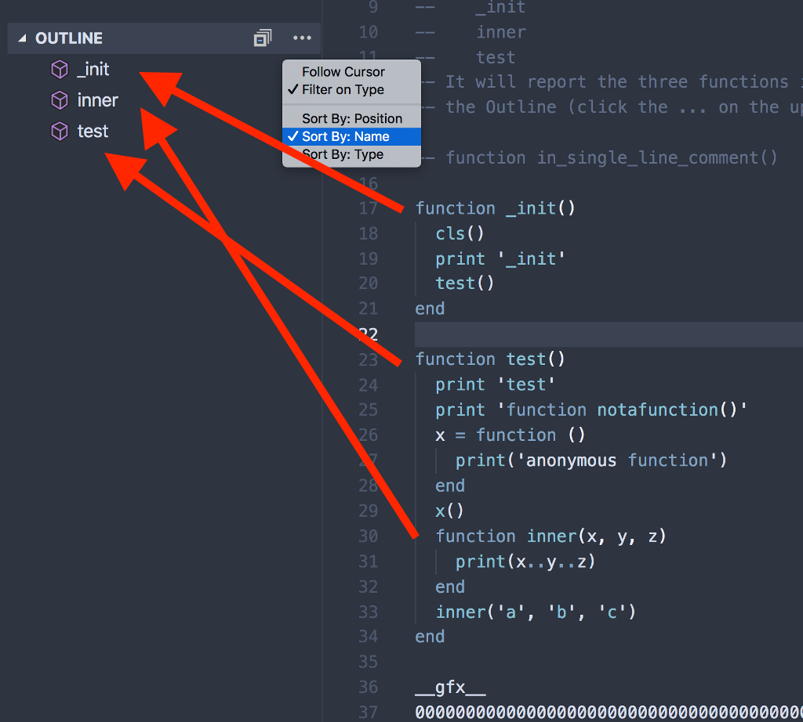
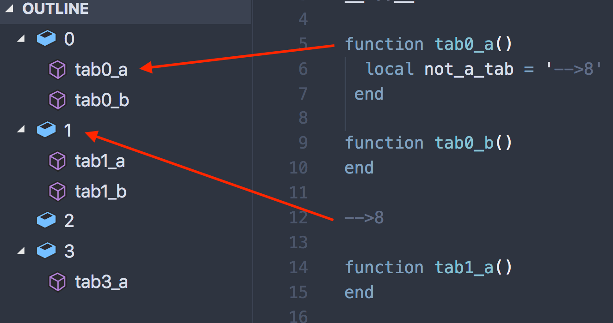

# 4gl-outline-dxc

This plugin runs this regex:
```
/^ *function /i
/^ *MAIN($|\s+)/
/^ *GLOBALS ).+/
```
on *.4gl files to fill the Outline view of Visual Studio Code with function names. It also runs the regex:
```
/^-->8$/
```
to group functions by tabs, if any.



### With tabs:



## Requirements

No dependencies, but it was originally intended to be used with [4gl-outline-dxc](https://github.com/dxcdeng/4gl-outline-dxc), and they seem to work together without conflict.

## Known Issues


## Build and Release

https://code.visualstudio.com/api/working-with-extensions/publishing-extension

## Release Notes

See [CHANGELOG.md](CHANGELOG.md) for more information.
